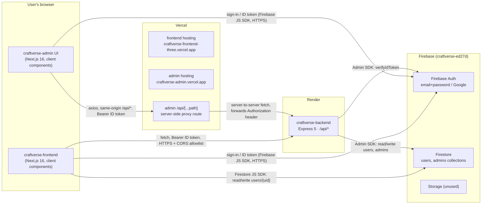
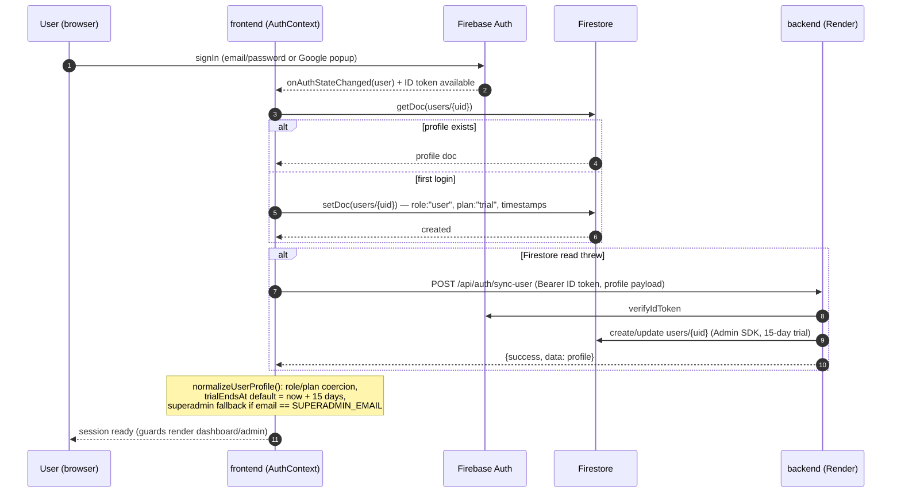
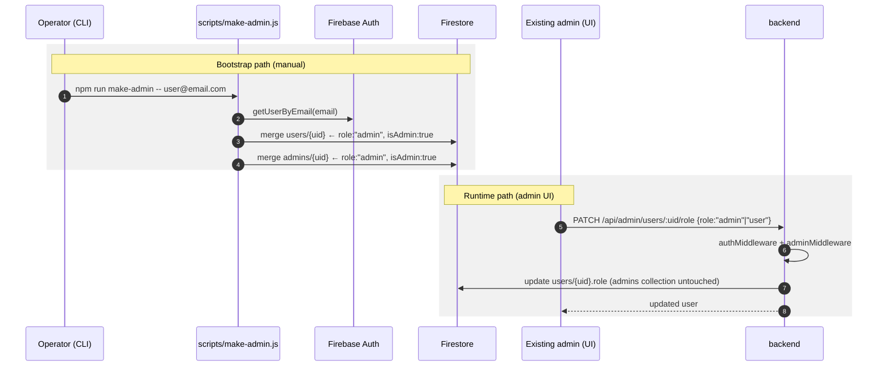

# CraftVerse — End-to-End Architecture

> Covers all three repositories: `craftverse-frontend`, `craftverse-backend`, `craftverse-admin`.
> Generated from a source-level review on 2026-07-19. Companion document: [SecurityPosture.md](./SecurityPosture.md).

---

## 1. System overview

CraftVerse is an AI-powered craft learning platform (see `AGENTS.md` for the product vision). The running system today consists of:

- **`craftverse-frontend`** — the customer-facing Next.js app (learning, dashboard, pricing, plus an embedded admin console). Deployed on **Vercel** at `https://craftverse-frontend-three.vercel.app`.
- **`craftverse-admin`** — a standalone Next.js admin app (user management, pricing, tutorials, categories, settings). Deployed on **Vercel** at `https://craftverse-admin.vercel.app`.
- **`craftverse-backend`** — an Express 5 REST API. Deployed on **Render** at `https://craftverse-backend.onrender.com`.
- **Firebase** (project `craftverse-ed27d`) — Authentication (email/password + Google), Firestore (primary datastore), Storage (configured but unused).

Identity is Firebase-based end to end: browsers sign in with the Firebase client SDK, obtain an **ID token**, and send it as a `Authorization: Bearer <idToken>` header on every backend call. The backend verifies tokens with the Firebase **Admin SDK** and reads/writes Firestore server-side. The frontend *also* reads/writes Firestore (`users/{uid}`) directly from the browser.



Key structural points:

- **Two different backend-access patterns.** The frontend calls the backend **directly cross-origin** (relies on the backend CORS allowlist). The admin app calls **itself** (same-origin `/api/...`), and a Next.js catch-all route (`craftverse-admin/src/app/api/[...path]/route.ts`) proxies the request server-side to the backend, forwarding all headers except hop-by-hop ones (including `Authorization`).
- **No server-side rendering of protected data.** All route protection in both Next.js apps is client-component-based (there is **no `middleware.ts`** in either app). Data protection is entirely the backend's job (plus Firestore security rules, which are not stored in any repo).
- **Firestore is dual-written**: the backend writes profiles via the Admin SDK, and the frontend browser writes `users/{uid}` directly via the client SDK.

---

## 2. Repositories & tech stacks

| | craftverse-frontend | craftverse-admin | craftverse-backend |
|---|---|---|---|
| **Purpose** | Customer app + embedded admin console | Standalone admin console | REST API |
| **Framework** | Next.js 16 (App Router, `--webpack`), React 19 | Next.js 16.2 (App Router), React 19.2 | Express **5** (CommonJS JavaScript) |
| **Language** | TypeScript | TypeScript (strict) | JavaScript |
| **HTTP client** | native `fetch` | axios ^1.18 (via same-origin proxy) | — |
| **Firebase** | `firebase` v12 client SDK: Auth + Firestore (+ Storage exported, unused) | `firebase` v12 client SDK: **Auth only** | `firebase-admin` v14: Auth verify + Firestore |
| **UI** | Tailwind v4, shadcn/ui, Radix, framer-motion, next-themes, PWA (`@ducanh2912/next-pwa`) | Tailwind v4, lucide-react, next-themes, PWA assets in `public/` | — |
| **Validation / security middleware** | — | — | **none** (no helmet, no rate limiter, no validation lib) |
| **Tests / CI** | none | none | none |
| **Hosting** | Vercel (`craftverse-frontend-three.vercel.app`) | Vercel (`craftverse-admin.vercel.app`) | Render (`craftverse-backend.onrender.com`) |
| **Git remote** | github.com/kirantikoo/craftverse-frontend | github.com/kirantikoo/craftverse-admin | github.com/kirantikoo/craftverse-backend |

---

## 3. Feature inventory (implemented vs placeholder)

### craftverse-frontend

**Wired to real data / auth:**

| Feature | Route(s) | Notes |
|---|---|---|
| Login / signup | `app/login` | Firebase email+password and Google popup |
| Auth/session core | `src/context/AuthContext.tsx` | Profile bootstrap: Firestore-first, backend `sync-user` fallback, in-memory fallback |
| Onboarding & preferences | `app/onboarding`, `app/settings/preferences` | Writes interests/skill/goals to Firestore via `PreferenceFlow` |
| Dashboard shell | `app/dashboard` | `ProtectedRoute`-guarded; live plan label + trial days left (XP/badges/streaks are static mock values) |
| Pricing | `app/pricing` | Regional pricing (`src/lib/pricing.ts`), locale-based country detection, `localStorage` region persistence — no network |
| Embedded admin console | `app/admin/*` | Guarded by `AdminGuard`/`AdminShell`; dashboard, users (plan/status/role/delete), CRUD pages for tutorials/crafts/categories/pricing, read-only community/reports/subscriptions |

**Static placeholder UI (no data wiring, no auth gate):** `ai-tutor`, `shop`, `community`, `projects`, `explore`, `learn`, `create`, `profile`, `notifications`, `collections`, `settings`, `upgrade`, the craft category pages (`crochet`, `knitting`, `sewing`, `stitching`, `embroidery`, `painting`, `diy`), the landing page, and the tutorial pages (5 static tutorials from `src/data/tutorials.ts` with YouTube placeholders).

### craftverse-admin

All pages are real UIs that call the backend through the proxy, **but** every page seeds with mock data (`src/lib/mock-data.ts`) and silently falls back to it when the API call fails — see §6 Contract gaps.

| Page | Route | Backend calls |
|---|---|---|
| Login | `/login` | Firebase sign-in, then `GET /api/admin/me` role check |
| Dashboard | `/dashboard` | `GET /api/admin/dashboard` |
| Users | `/users` | `GET /api/admin/users`, `PATCH …/:id/role`, `PATCH …/:id/suspend`, `DELETE …/:id` |
| Subscriptions | `/subscriptions` | `GET /api/admin/users` (MRR estimated client-side as `premium × 19`) |
| Pricing | `/pricing` | `GET/PUT /api/admin/pricing` |
| Tutorials | `/tutorials` | `GET/POST/PATCH/DELETE /api/admin/tutorials` |
| Categories | `/categories` | `GET/POST/PATCH/DELETE /api/admin/categories` |
| Settings | `/settings` | `GET/PUT /api/admin/settings` |

### craftverse-backend

Implemented domains: **health**, **auth sync**, **user profile**, **pricing** (static country table), **subscription status** (computed from trial dates; Stripe checkout is an intentional stub), **admin** (user list, role change, stats). No AI, payments, tutorials, community, or shop endpoints exist yet.

---

## 4. Communication paths

1. **frontend browser → backend** — direct cross-origin `fetch` to `${NEXT_PUBLIC_API_URL}` with `Authorization: Bearer <Firebase ID token>`. Two call sites:
   - `src/lib/admin-api.ts` (`adminApi()`) — all `/api/admin/*` calls; unwraps `body.data ?? body`, throws `ApiError` on non-2xx.
   - `src/context/AuthContext.tsx` — `POST /api/auth/sync-user` (fallback path only).
2. **frontend browser → Firestore** — Firebase client SDK, collection `users/{uid}` only (read + create + merge-write). Enforcement depends on Firestore security rules (not in any repo).
3. **admin browser → admin server → backend** — axios with no `baseURL` hits the admin app's own `/api/[...path]` route; the route forwards method/body/query and all non-hop-by-hop headers to `getApiBaseUrl()` (`NEXT_PUBLIC_API_URL` → prod default `https://craftverse-backend.onrender.com` → dev default `http://localhost:5001`). The browser never talks to the backend directly, so CORS never applies to the admin app.
4. **backend → Firebase** — Admin SDK initialized from env vars (`FIREBASE_PROJECT_ID`, `FIREBASE_CLIENT_EMAIL`, `FIREBASE_PRIVATE_KEY`); `verifyIdToken` for auth, Firestore reads/writes for data.

**Backend CORS allowlist** (`craftverse-backend/src/index.js:15-38`): `http://localhost:3000`, `http://localhost:3001`, `https://craftverse-admin.vercel.app`, `https://craftverse-frontend-three.vercel.app`; requests with **no Origin header are allowed** (curl, server-to-server — this is how the admin proxy gets through); `credentials: true`; disallowed origins error out through the global error handler.

---

## 5. API contracts (implemented endpoints)

All routes are mounted in `craftverse-backend/src/index.js`. Response envelope is `{ success: boolean, message?, data? }`. Access levels: **Public** = no middleware; **Auth** = `authMiddleware` (valid Firebase ID token); **Admin** = `authMiddleware` + `adminMiddleware` (admin role resolved from Firestore).

| Method | Path | Access | Request | Response (`data`) |
|---|---|---|---|---|
| GET | `/api/health` | Public | — | — (`{success:true, message:"CraftVerse backend is running"}`) |
| POST | `/api/auth/sync-user` | Auth | `{name?, email?, photoURL?, country?}` (falls back to token claims `name`/`email`/`picture`) | Full user profile. Creates the Firestore `users/{uid}` doc on first call with a 15-day trial; updates it afterwards. |
| GET | `/api/users/me` | Auth | — | `{uid, email, displayName, photoURL, role}` — **⚠ bug: returns 403 for non-admin users** (controller reuses the admin-access check; see §8) |
| PATCH | `/api/users/me` | Auth | `{name?, photoURL?, country?}` | Updated profile |
| GET | `/api/pricing?country=XX` | Public | query `country` (default `US`) | `{country, currency, amount, interval:"month", displayPrice}` |
| GET | `/api/subscription/status` | Auth | — | `{subscriptionStatus, trialStartDate, trialEndDate}`; 404 if no profile |
| POST | `/api/subscription/start-checkout` | Auth | — | `{message:"Stripe integration coming next"}` (**stub** — no payment logic) |
| GET | `/api/admin/me` | Auth (admin enforced inside the controller) | — | `{uid, email, displayName, photoURL, role}`; **403** if the caller is not an admin — this is the endpoint the admin app uses to verify admin role at login |
| GET | `/api/admin/users` | Admin | — | Array of all users (ordered `createdAt desc`), each with computed `subscriptionStatus` |
| PATCH | `/api/admin/users/:uid/role` | Admin | `{role}` — only `"user"` or `"admin"` accepted (400 otherwise; `superadmin` cannot be set via the API) | Updated user |
| GET | `/api/admin/stats` | Admin | — | `{totalUsers, trialUsers, premiumUsers, expiredUsers}` |

Error contract: 401 `"Invalid or expired authorization token"` (bad/missing token), 403 `"Admin access required"`, 404 `{success:false, message:"Route not found"}`, 500 with the raw `error.message` (see SecurityPosture.md — information-leak note).

### 5.1 ⚠ Called but NOT implemented (contract gaps)

Both frontends call admin endpoints that **do not exist** in the backend. These currently return `404 Route not found`; the admin app then silently falls back to mock data, and the frontend admin pages surface errors or show empty states.

| Endpoint called | Called by |
|---|---|
| `GET /api/admin/dashboard` | both frontends (backend implements `GET /api/admin/stats` instead) |
| `PATCH /api/admin/users/:uid/plan` · `PATCH …/:uid/status` | frontend `app/admin/users` |
| `PATCH /api/admin/users/:id/suspend` | admin app `/users` |
| `DELETE /api/admin/users/:id` | both frontends |
| `GET/POST/PATCH/DELETE /api/admin/tutorials` | both frontends |
| `GET/POST/PATCH/DELETE /api/admin/categories` | both frontends |
| `GET/POST/DELETE /api/admin/crafts` | frontend `app/admin/crafts` |
| `GET/PUT /api/admin/pricing` | both frontends |
| `GET/PUT /api/admin/settings` | admin app `/settings` |
| `GET /api/admin/community/reports` · `GET /api/admin/reports` · `GET /api/admin/subscriptions` | frontend read-only admin pages |

The backlog implied by these gaps is the real "admin API v2" surface. Until they exist, the only admin mutations that actually persist are **role changes** (`user`↔`admin`) — plan/status/suspend/delete and all content CRUD are UI-only.

---

## 6. Authentication & authorization, end to end

### 6.1 Identity & tokens

- Sign-in methods: **email/password** and **Google popup** (`prompt: select_account`), via the Firebase JS SDK in both Next.js apps.
- The Firebase SDK manages session persistence itself (IndexedDB). Neither app writes tokens to `localStorage`/cookies. The admin app keeps the current ID token as an in-memory axios default header; the frontend calls `getIdToken()` on demand per request.
- The backend verifies every protected request with `auth.verifyIdToken(token)` (`src/middleware/authMiddleware.js`) and attaches the decoded token as `req.user`.

### 6.2 Roles — storage and resolution

Roles are **Firestore document fields, not Firebase custom claims**.

- `users/{uid}.role` ∈ `"user" | "admin" | "superadmin"` (default `"user"`).
- A separate **`admins/{uid}`** collection also exists; membership there is treated as admin.

Backend admin resolution (`src/services/user.service.js` → `getAdminAccessProfile`) checks **four sources in parallel**: `admins/{uid}`, `users/{uid}`, first `users` doc with matching email, first `admins` doc with matching email — then scores candidates (preferring the `admins` collection) and grants access if `role ∈ {admin, superadmin}` **or** `isAdmin === true` **or** `admin === true`. A doc found in `admins` without a role is force-promoted to `role:"admin"`.

Role assignment paths:

1. **`scripts/make-admin.js`** (manual CLI, `npm run make-admin -- user@email.com`) — the bootstrap path; writes `role:"admin", isAdmin:true` to **both** `users/{uid}` and `admins/{uid}`.
2. **`PATCH /api/admin/users/:uid/role`** (admin-only) — toggles `users/{uid}.role` between `user`/`admin` only. `superadmin` is never assignable via API.
3. **Client-side fallback** (frontend only, `src/lib/access.ts:7` + `AuthContext.normalizeRole`): if a profile has no stored role **and** the email equals `SUPERADMIN_EMAIL` (`kirantikoo@gmail.com`), the frontend treats the user as `superadmin` — a display-level convenience the backend does not honor.

### 6.3 Plans & trial

`plan` ∈ `"trial" | "free" | "premium"`. New profiles get `plan:"trial"` with a **15-day** trial (`TRIAL_DAYS` in frontend `src/lib/subscription.ts`; `addDays(trialStartDate, 15)` in backend `user.service.js`). Effective status is computed, not stored: `premium` if subscribed, else `trial` while `trialEndDate >= now`, else `expired`. `hasPremiumAccess()` = staff OR premium OR active trial. Stripe is not integrated yet (checkout endpoint is a stub).

### 6.4 Route guards (client-side only)

| Guard | App | Logic |
|---|---|---|
| `components/auth/ProtectedRoute.tsx` | frontend | no user → `/login`; non-staff without `onboardingCompleted` → `/onboarding`. Currently used only by `dashboard` and `settings/preferences`. |
| `components/auth/PremiumGate.tsx` | frontend | `ProtectedRoute` + `hasPremiumAccess()` else upgrade screen. **Not used by any route yet** — premium gating is currently unwired. |
| `components/admin/AdminGuard.tsx` (via `AdminShell`) | frontend | no user → `/login?next=/admin`; non-staff → `/dashboard`. |
| `src/components/auth/protected-route.tsx` | admin | unauthenticated → `/login`; non-admin (or backend 403) → Access Denied + sign-out. |

These guards control **rendering only**. The enforced security boundary is the backend (`authMiddleware` + `adminMiddleware`) and Firestore rules.

### 6.5 Two admin consoles

There are currently **two** admin UIs: the embedded one at `craftverse-frontend/app/admin/*` (wired, in use) and the standalone `craftverse-admin` app. The frontend also contains a vestigial `app/admin/AdminRedirect.tsx` (would redirect staff to the external admin app via `src/lib/admin.ts` → `NEXT_PUBLIC_ADMIN_URL`), but it is **dead code** — the inline console renders instead. Long-term, one of the two consoles should be chosen as canonical.

---

## 7. Sequence diagrams

### 7.1 User sign-in & profile bootstrap (frontend)



### 7.2 Authenticated frontend → backend call

```mermaid
sequenceDiagram
    autonumber
    participant FE as frontend (adminApi / fetch)
    participant FA as Firebase Auth SDK
    participant BE as backend (Express 5)
    participant FS as Firestore

    FE->>FA: user.getIdToken()
    FA-->>FE: ID token (JWT)
    FE->>BE: fetch https://…onrender.com/api/… <br/>Authorization: Bearer <idToken> (CORS allowlist applies)
    BE->>BE: authMiddleware — require "Bearer " prefix
    BE->>FA: auth.verifyIdToken(token) (Admin SDK)
    alt invalid/expired
        BE-->>FE: 401 {success:false, message:"Invalid or expired authorization token"}
    else valid
        BE->>FS: controller reads/writes (Admin SDK)
        FS-->>BE: data
        BE-->>FE: 200 {success:true, data}
    end
    FE->>FE: unwrap body.data ?? body; throw ApiError on non-2xx
```

### 7.3 Admin app request path (proxy + admin check)

```mermaid
sequenceDiagram
    autonumber
    participant AD as admin UI (browser, axios)
    participant PX as admin app server<br/>/api/[...path] proxy
    participant BE as backend (Express 5)
    participant FA as Firebase Auth
    participant FS as Firestore

    Note over AD: at login: getIdToken(true) →<br/>axios default header set
    AD->>PX: GET /api/admin/me (same-origin, Bearer token)
    PX->>BE: fetch https://…onrender.com/api/admin/me<br/>(forwards all non-hop-by-hop headers incl. Authorization)
    BE->>FA: verifyIdToken
    BE->>FS: getAdminAccessProfile — 4 lookups:<br/>admins/{uid}, users/{uid}, users by email, admins by email
    alt not an admin
        BE-->>PX: 403 Admin access required
        PX-->>AD: 403
        AD->>AD: AdminAccessDeniedError → signOut() → "Access Denied"
    else admin
        BE-->>PX: 200 {uid, email, role, …}
        PX-->>AD: 200
        AD->>PX: subsequent /api/admin/* calls (users, pricing, …)
        PX->>BE: forwarded; authMiddleware + adminMiddleware on each route
        Note over AD: on any API failure the page silently<br/>falls back to mock data (see §5.1)
    end
```

### 7.4 Admin role grant



---

## 8. Data model (Firestore)

### `users/{uid}` — created by backend `syncUser` *or* directly by the frontend browser

```
{
  uid, name, email, photoURL, country,
  role: "user",                    // "user" | "admin" | "superadmin"
  plan: "trial",                   // frontend-written field
  trialStartDate, trialEndDate,    // backend-written (Timestamp, +15 days)
  trialEndsAt,                     // frontend-normalized variant
  subscriptionStatus: "trial",     // stored; effective status computed at read time
  interests: [], learningGoals: [], skillLevel: null,   // onboarding (frontend)
  onboardingCompleted: false,
  createdAt, updatedAt
}
```

Note the two writers produce slightly different shapes (backend: `trialStartDate`/`trialEndDate`; frontend: `trialEndsAt`, `interests`, etc.). `normalizeUserProfile()` in the frontend and `getSubscriptionStatus()` in the backend each tolerate the differences, but there is no single canonical schema.

### `admins/{uid}` — written only by `scripts/make-admin.js`

```
{ uid, email, displayName, photoURL, role: "admin", isAdmin: true, updatedAt }
```

Membership in this collection is sufficient for backend admin access.

### Frontend static content models

- `src/data/tutorials.ts` — the static `Tutorial` shape used by tutorial detail pages (steps, materials, tips, common mistakes, XP) — maps to the AGENTS.md "AI Tutor Workflow".
- `src/lib/personalization.ts` — the separate `PersonalizedTutorial`/`Preferences` model with scoring (`scoreTutorial`, `recommendedTutorials`, `relatedTutorials`). Two distinct tutorial shapes; don't conflate them.

---

## 9. Deployment topology

| Component | Platform | Trigger | Config location |
|---|---|---|---|
| craftverse-frontend | Vercel | push to `main` (GitHub integration) | Vercel dashboard (env vars: `NEXT_PUBLIC_FIREBASE_*`, `NEXT_PUBLIC_API_URL`, `NEXT_PUBLIC_ADMIN_URL`) |
| craftverse-admin | Vercel | push to `main` | Vercel dashboard (env vars: `NEXT_PUBLIC_FIREBASE_*`, `NEXT_PUBLIC_API_URL`) |
| craftverse-backend | Render | push to `main` | Render dashboard (env vars: `PORT`, `FIREBASE_PROJECT_ID`, `FIREBASE_CLIENT_EMAIL`, `FIREBASE_PRIVATE_KEY`) |
| Firebase | Google | console-managed | Firebase console (Auth providers, Firestore rules — **rules are not in any repo**) |

There is **no CI/CD configuration in any repository** — no GitHub Actions, no `vercel.json`, no `render.yaml`, no Dockerfile. All platform behavior (build commands, env vars, domains) lives in the Render/Vercel dashboards. Local dev: backend on `:5001` (`npm run dev`, nodemon), frontend on `:3000`, admin on `:3001`; both dev origins are in the backend CORS allowlist.

---

## 10. Known gaps & inconsistencies

1. **Admin API mismatch** — most admin endpoints called by both UIs don't exist server-side (§5.1); admin-app pages mask this with silent mock-data fallbacks and optimistic updates, so admin actions can appear to succeed without persisting.
2. **`GET /api/users/me` bug** — the controller reuses the admin-access check, so regular users get 403 from their own profile endpoint.
3. **Two admin consoles** — embedded (`app/admin/*`, active) vs standalone app; plus dead `AdminRedirect.tsx`. Pick one.
4. **`PremiumGate` unused** — premium/trial gating exists but no route is actually gated; all craft/learning pages are public.
5. **Firebase Storage** exported in `src/lib/firebase.ts` but never used.
6. **Dashboard endpoint naming** — UIs call `/api/admin/dashboard`; backend implements `/api/admin/stats`.
7. **Divergent `users/{uid}` schema** between backend and frontend writers (no canonical schema; each side normalizes).
8. **Firestore security rules not versioned** in any repo — the write-side trust boundary can't be reviewed or tested from source (see SecurityPosture.md, finding #1).
