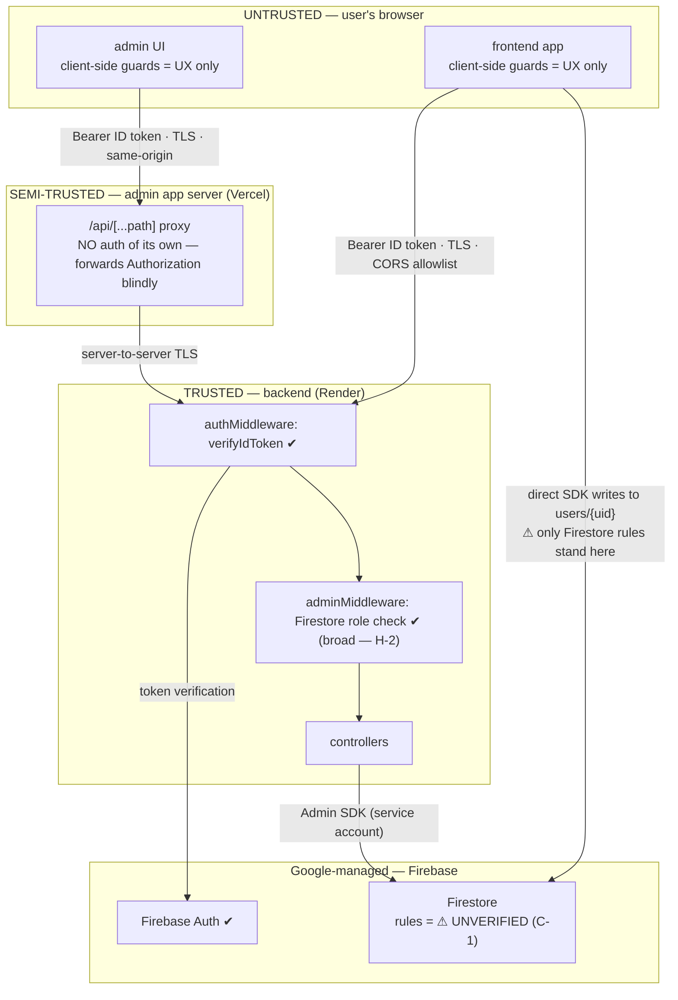

# CraftVerse — Security Posture Evaluation

> Combined assessment of `craftverse-frontend`, `craftverse-backend`, and `craftverse-admin`, including deployment pipeline, data in transit, and data at rest.
> Source-level review performed 2026-07-19. Companion document: [Architecture.md](./Architecture.md).
>
> ⚠ **Handling note:** this document names real URLs, an operator email, and concrete weaknesses. Keep it out of any public repository until the high-priority findings are remediated.

---

## 1. Scope & method

**Reviewed:** full source, configuration, `.gitignore` coverage, and complete git history of all three repositories; local `.env` files (key names and secret placement only); the parent working folder `D:\CRAFTVERSE\` for loose credential material.

**Could NOT be verified from the repositories** (documented as gaps, not assumptions):

- **Firestore security rules and Storage rules** — not versioned in any repo; managed only in the Firebase console. This is the single most load-bearing unknown (Finding C-1).
- Render/Vercel dashboard settings (build commands, env var scoping, branch protection on GitHub, custom domains, TLS settings beyond platform defaults).
- Firebase console settings (authorized domains, App Check, MFA, email enumeration protection, API-key restrictions).

**Deployment model (confirmed by owner):** backend on Render (`craftverse-backend.onrender.com`), both Next.js apps on Vercel (`craftverse-frontend-three.vercel.app`, `craftverse-admin.vercel.app`), auto-deploy on push to `main` via GitHub integration. No CI exists in any repo.

---

## 2. Executive summary

The overall design has a sound core: **every implemented backend endpoint verifies a Firebase ID token server-side, admin endpoints additionally verify an admin role from Firestore, tokens are never persisted to browser storage, and no secrets have ever been committed to git in any of the three repos.** For a pre-launch product with no payments and minimal PII, the baseline is reasonable.

The risk concentrates in three places:

1. **The Firestore write path from the browser.** The frontend creates and merges `users/{uid}` documents — including `role` and `plan` fields — directly from the client. Whether a user can grant themselves `admin` or `premium` depends entirely on Firestore security rules that are not in any repo and could not be reviewed. Because the backend resolves admin access *from those same Firestore documents*, permissive rules would make **client-side privilege escalation into real backend admin access**. This must be verified immediately.
2. **A broad admin-resolution surface in the backend** — admin access is granted from any of four lookups (two by email), boolean flags (`isAdmin`/`admin`) count as roles, and bare membership in the `admins` collection is force-promoted to admin.
3. **No hardening layer anywhere** — no rate limiting, no security headers (backend or either Next app), no input validation, verbose logging of identifiers, raw error messages returned to clients, and a deploy pipeline with no review gate, tests, or scanning.

Additionally, **live credential material is sitting loose on the development machine** outside the repos, including a Firebase service-account private key.

| # | Finding | Severity |
|---|---|---|
| C-1 | Firestore rules unverifiable while the browser writes `users/{uid}` incl. `role`/`plan` — potential self-escalation to admin/premium | **Critical (unverified)** |
| H-1 | Loose credentials on disk outside repos (service-account key JSON, password files) | High |
| H-2 | Over-broad backend admin resolution (4 lookups, email matching, boolean flags, `admins` membership = admin) | High |
| M-1 | No rate limiting or brute-force protection on the backend | Medium |
| M-2 | No HTTP security headers in any of the three apps | Medium |
| M-3 | No input validation; client fields written to Firestore unsanitized | Medium |
| M-4 | Error handler leaks internal `error.message`; verbose PII logging to platform logs | Medium |
| M-5 | Deployment pipeline: push-to-`main` auto-deploys to prod with no review, tests, or scanning | Medium |
| M-6 | Admin UIs silently fall back to mock data — failed admin actions look successful (integrity risk) | Medium |
| L-1 | Client-side superadmin bootstrap by hardcoded email (frontend display-level) | Low |
| L-2 | `GET /api/users/me` denies regular users (bug, availability only) | Low |
| L-3 | CORS `credentials: true` + null-origin allowance (mostly cosmetic; CORS is not an auth control) | Low |

---

## 3. Trust boundaries

The critical observation: there are **two independent doors into Firestore** — the backend (properly guarded) and the browser SDK (guarded only by console-managed rules nobody has reviewed). And because backend authorization *reads* what the browser path can potentially *write*, the two doors are not independent in effect.

---

## 4. Findings

### C-1 (Critical, unverified) — Firestore rules gap enables potential privilege escalation

**Evidence:**
- Frontend creates `users/{uid}` from the browser: `src/context/AuthContext.tsx` (`getFirestoreUserProfile` → `setDoc` with `role: "user"`, `plan: "trial"`); `components/common/PreferenceFlow.tsx` merge-writes the same doc.
- Backend grants admin API access from Firestore docs: `craftverse-backend/src/services/user.service.js` (`getAdminAccessProfile`, `hasAdminAccess`).
- No `firestore.rules`, `storage.rules`, or `firebase.json` exists in any of the three repos.

**Impact:** If rules allow a signed-in user to write their own `users/{uid}` doc without field restrictions (a very common default while prototyping), any user can set `role: "admin"` or `isAdmin: true` — and the **backend will then honor it**, granting the full admin API (list all users, change roles). Setting `plan: "premium"` similarly bypasses monetization. If rules allow writes to the `admins` collection, creating `admins/{uid}` grants admin outright (see H-2).

**Recommendation (P0):**
1. Export the deployed rules from the Firebase console **today** and review them.
2. Rules must at minimum: deny all access by default; allow a user to read only their own `users/{uid}`; allow create/update of their own doc **only for whitelisted fields** (`name`, `photoURL`, `country`, `interests`, `learningGoals`, `skillLevel`, `onboardingCompleted`, `updatedAt`) — explicitly rejecting writes that touch `role`, `plan`, `isAdmin`, `admin`, `subscriptionStatus`, `trialStartDate`, `trialEndDate`, `trialEndsAt`; deny **all client access** to the `admins` collection.
3. Check the rules into a repo (`firebase.json` + `firestore.rules`, ideally in `craftverse-backend`), deploy them via CLI/CI, and add Firestore emulator tests for the deny cases.
4. Longer term: move role/plan enforcement to **Firebase custom claims** set by the backend (Admin SDK), so entitlement rides inside the verified token instead of client-writable documents.

### H-1 (High) — Loose credentials on the development machine

**Evidence (outside the repos, in `D:\CRAFTVERSE\`):**
- `craftverse-ed27d-firebase-adminsdk-fbsvc-46d4bf145a.json` — a **Firebase service-account private key**. This credential has full Admin SDK power: read/write all of Firestore, mint tokens, manage users — bypassing all security rules.
- `pw-s@19asperlast.txt` — a filename that appears to embed a password.
- `hostinger.txt`, `craftverse.com.au.txt` — hosting/domain notes that may contain credentials.
- Local `.env` (backend) and `.env.local` files contain real credentials — this is expected and they are correctly gitignored, but they live one folder away from a directory tree that also holds media/assets and may get zipped/synced/shared.

**Impact:** Anyone with access to this machine, a backup, or a cloud-sync of `D:\CRAFTVERSE\` obtains god-mode access to the Firebase project and possibly hosting/domain accounts. Loose key files are also one accidental `git add`/attachment away from public exposure.

**Recommendation (P0):**
1. **Rotate the service-account key now** (Firebase console → Service accounts → delete the key ID matching `46d4bf145a`, generate a new one) and update Render's env vars. Rotation is cheap; assume the old key is burned.
2. Delete the JSON and password `.txt` files from `D:\CRAFTVERSE\`; move passwords to a password manager.
3. Keep secrets only in platform env stores (Render/Vercel dashboards) and local gitignored `.env` files inside each repo.

### H-2 (High) — Over-broad backend admin resolution

**Evidence:** `craftverse-backend/src/services/user.service.js`:
- `getAdminAccessProfile` resolves admin identity from **four** sources: `admins/{uid}`, `users/{uid}`, first `users` doc where `email ==`, first `admins` doc where `email ==`.
- `hasAdminAccess` accepts `role ∈ {admin, superadmin}` **or** `isAdmin === true` **or** `admin === true`.
- A doc found in the `admins` collection with no role at all is force-promoted to `role: "admin"` (lines ~217–219).

**Impact:** The attack surface for becoming admin is any one of: a role string, either of two boolean flags, in either of two collections, matched by uid **or by email**. Email-based matching means a stale/duplicate profile doc with an attacker-controlled email could confer admin. Every additional path is another thing Firestore rules must lock down perfectly (compounding C-1). Unverified-email accounts are a particular hazard for email-based matching (Google sign-in verifies email; email/password sign-up does not by default).

**Recommendation (P1):** Collapse to a single source of truth — `admins/{uid}` keyed strictly by uid, or better, custom claims. Drop email-based lookups and the boolean-flag aliases; require an explicit `role` field. If email matching must stay temporarily, require `decodedToken.email_verified === true`.

### M-1 (Medium) — No rate limiting or abuse protection

**Evidence:** `craftverse-backend/src/index.js` — middleware chain is logger → CORS → `express.json()` → routes. No `express-rate-limit`, no brute-force lockout, no request throttling. (Firebase Auth itself rate-limits credential attempts, which covers password brute force; backend endpoints are not covered.)

**Impact:** Unauthenticated endpoints (`/api/health`, `/api/pricing`) and token-validation attempts can be hammered freely; every request to a protected route costs a `verifyIdToken` and Firestore reads — a cost-amplification and availability risk on Render's small instances.

**Recommendation (P1):** Add `express-rate-limit` globally (e.g. 100 req/min/IP) with a tighter bucket on `/api/auth/*` and `/api/admin/*`. Consider Firebase App Check later for client attestation.

### M-2 (Medium) — No HTTP security headers anywhere

**Evidence:** backend has no `helmet`; both `next.config.ts` files define no `headers()` — no CSP, HSTS, `X-Frame-Options`/`frame-ancestors`, `X-Content-Type-Options`, `Referrer-Policy`, or `Permissions-Policy` on any app.

**Impact:** No defense-in-depth against XSS (no CSP), clickjacking of the admin consoles (no frame-ancestors), or MIME sniffing. The code currently has no `dangerouslySetInnerHTML` and no stored user content is rendered, so exploitability is low today — but the platform roadmap (community content, tutorials, uploads) will change that.

**Recommendation (P1):** Backend: add `helmet()`. Both Next apps: add a `headers()` block with `Strict-Transport-Security`, `X-Content-Type-Options: nosniff`, `X-Frame-Options: DENY` (or CSP `frame-ancestors 'none'`), `Referrer-Policy: strict-origin-when-cross-origin`, and a starter CSP. Prioritize the two admin surfaces.

### M-3 (Medium) — No input validation

**Evidence:** No validation library in the backend. `syncUser` and `updateMe` (`user.service.js`) write client-supplied `name`, `photoURL`, `country` (and on sync, `email`) to Firestore with no type, length, or format checks. The only whitelist in the codebase is `updateUserRole`'s `["user","admin"]`. Client-generated IDs (`crypto.randomUUID()` from the admin app) are posted for tutorials/categories.

**Impact:** Oversized or malformed values (multi-KB "names", `javascript:` URLs in `photoURL`, objects where strings are expected) land in the datastore and are later rendered by three different UIs. Stored-XSS risk is currently mitigated by React's default escaping and the absence of raw HTML rendering, but the data layer itself accepts garbage; `photoURL` will eventually be used in ``/links.

**Recommendation (P1):** Add `zod` (or `joi`) schemas per endpoint: bounded string lengths, `photoURL` must be `https:`, `country` ISO-3166 alpha-2, reject unknown fields. Validate at the route boundary before any service call.

### M-4 (Medium) — Error-message leakage and verbose identifier logging

**Evidence:** `src/index.js:56-63` returns raw `error.message` to clients (any Firestore/Firebase internal error text goes to the caller; CORS rejections surface as 500 `"Not allowed by CORS"`). Console logging on every request includes origin, auth-header presence, decoded UIDs (`authMiddleware.js`), and emails on admin-lookup misses — all persisted in Render logs.

**Impact:** Internal error strings can reveal stack/infra details to attackers; PII (emails, UIDs) accumulates in platform logs outside any retention policy.

**Recommendation (P2):** Map errors to generic client messages (keep detail server-side only); log with a leveled logger (`pino`), redact emails/UIDs at info level, and treat CORS rejection as 403 with a static message.

### M-5 (Medium) — Deployment pipeline has no gates

**Evidence:** No `.github/workflows`, `vercel.json`, `render.yaml`, or Dockerfile in any repo; single `main` branch in each; deploys fire automatically on push. No tests exist; lint is not enforced pre-deploy; no dependency audit or secret scanning; platform config lives only in dashboards (no IaC, no reproducibility).

**Impact:** A single bad or malicious push to any `main` goes straight to production for all users; a leaked GitHub credential = production compromise across all three apps. No automated check would catch a committed secret, a vulnerable dependency, or a build break before users see it.

**Recommendation (P1):**
1. Enable **GitHub branch protection** on `main` in all three repos (PRs required, at least CI green; add required review when a second person joins).
2. Add a minimal GitHub Actions workflow per repo: `npm ci && npm run lint && npm run build` (backend: `node --check` / add lint), plus `npm audit --audit-level=high`.
3. Enable **GitHub secret scanning + push protection** (free for public, available for private via Advanced Security; alternatively add `gitleaks` to CI).
4. Enable Dependabot security updates.
5. Point Vercel/Render deploys at `main` only after CI passes (Render: "Wait for CI"; Vercel: ignored build step or protected branch).
6. Longer term: commit `render.yaml`/`vercel.json` so platform config is versioned.

### M-6 (Medium) — Admin UIs silently mask failed operations

**Evidence:** Every `craftverse-admin` page seeds with mock data and on API failure does `.catch(() => setX(mock))`; mutations `.catch(() => undefined)` while optimistically updating local state. Most endpoints they call don't exist yet (see Architecture.md §5.1), so **most admin actions currently no-op against production while appearing to succeed**.

**Impact:** Integrity/operational risk rather than a vulnerability: an operator can believe they suspended or deleted a user when nothing happened. Mock data shown as real also risks decisions made on fake numbers.

**Recommendation (P1):** Remove silent fallbacks — surface errors in the UI, only update state on 2xx, and visibly label any mock/demo data. Track the unimplemented-endpoint list from Architecture.md §5.1 as the actual backlog.

### L-1 (Low) — Client-side superadmin bootstrap by hardcoded email

**Evidence:** `craftverse-frontend/src/lib/access.ts:7` (`SUPERADMIN_EMAIL = "kirantikoo@gmail.com"`); `AuthContext.normalizeRole` returns `superadmin` when a profile has no role and the email matches.

**Impact:** Display-level only — the backend never honors it (`superadmin` is not assignable via API and backend resolution reads Firestore, not this constant). Risks: the operator email is published in a public repo (spear-phishing/targeting), and the client UI can present admin chrome whose API calls then 403. Anyone who *controls* that email account plus permissive Firestore rules (C-1) would combine badly.

**Recommendation (P2):** Remove the fallback once the real account has a stored role; keep operator identity out of client bundles.

### L-2 (Low) — `GET /api/users/me` rejects regular users

**Evidence:** `craftverse-backend/src/controllers/users.controller.js` `getMe` runs `getAdminAccessProfile` + `hasAdminAccess` and 403s non-admins — an apparent copy-paste from the admin controller.

**Impact:** Availability bug, not a vulnerability (it fails closed). Regular users cannot fetch their profile via the API; the frontend currently masks this by reading Firestore directly.

**Recommendation (P2):** Reimplement `getMe` to return the caller's own profile with no admin check.

### L-3 (Low) — CORS posture notes

**Evidence:** `src/index.js` — explicit origin allowlist (good), but `credentials: true` (unnecessary — auth is via Bearer header, not cookies) and requests with no `Origin` header are allowed.

**Impact:** Minimal. CORS is not an authentication control; null-origin allowance simply reflects that non-browser clients aren't constrained by CORS anyway. `credentials: true` is dormant risk only if cookie auth is ever added.

**Recommendation (P2):** Drop `credentials: true`; keep the allowlist in an env var so prod domains aren't hardcoded.

### Positive observations (what's already right)

- Every implemented protected endpoint verifies the Firebase ID token server-side; admin endpoints re-check the role per request — client guards are correctly treated as UX, and both admin UIs fail closed on 403.
- `superadmin` is not assignable through any API; role changes are whitelisted to `user`/`admin`.
- **Git hygiene is clean in all three repos**: `.env*` and `*.pem` properly gitignored; full-history audit found no secret ever committed; `.env.example` contains placeholders only.
- Backend credentials come from env vars — no service-account JSON is read from disk in code.
- Tokens are never placed in `localStorage`/cookies; the Firebase SDK manages persistence, and the admin app holds tokens in memory only.
- No `dangerouslySetInnerHTML`, no `eval`, no raw HTML rendering anywhere in either Next app.
- The admin app's same-origin proxy avoids exposing the backend to a wider CORS surface.

---

## 5. Authentication & authorization assessment

**What is enforced server-side (real security):** token validity on every protected route (`authMiddleware`); admin role from Firestore on every `/api/admin/*` route (`adminMiddleware`) and inside `/api/admin/me`; role-change whitelist (`user`/`admin`).

**What is client-side only (UX, not security):** all route guards in both Next apps (`ProtectedRoute`, `PremiumGate` — currently unused, `AdminGuard`, admin-app `protected-route`); trial/premium entitlement (`hasPremiumAccess` evaluated in the browser against the browser clock); the superadmin email fallback; onboarding gating.

**Escalation paths to watch, in order of concern:**
1. Browser → Firestore `users/{uid}.role`/`isAdmin` write (if rules permit) → backend admin API access. **(C-1 + H-2 — the one that matters.)**
2. Browser → `admins/{uid}` creation (if rules permit) → automatic admin. **(C-1 + H-2.)**
3. Email-matched stale profile docs conferring admin. **(H-2.)**
4. Compromised GitHub account → push to `main` → auto-deploy to prod. **(M-5.)**
5. Compromised dev machine → loose service-account key → full project takeover. **(H-1.)**

**Premium/monetization enforcement:** currently there is none server-side — `PremiumGate` is unwired, all content pages are public, and `plan` is client-writable pending C-1. Acceptable pre-Stripe; must be redesigned (server-checked entitlement, ideally custom claims) before paid content ships.

---

## 6. Data in transit

- **Production:** all hops are HTTPS with platform-managed TLS — browser→Vercel, browser→Render, admin-proxy(Vercel)→Render, browser→Firebase (SDK), backend→Firebase (Admin SDK, gRPC/TLS). No custom TLS config exists (nothing to misconfigure; also no HSTS — see M-2).
- **Auth material in transit:** Firebase ID tokens travel only in `Authorization` headers over TLS; never in URLs or cookies. The admin proxy forwards the header server-side.
- **Local development:** plain HTTP on localhost (`:3000`/`:3001`/`:5001`) — normal and acceptable.
- **Gap:** no HSTS header on any app; Render/Vercel redirect HTTP→HTTPS at the edge by default, but HSTS (+preload) would pin it (M-2).

## 7. Data at rest

- **Datastore:** Firestore only. Google encrypts Firestore, Auth data, and Storage at rest by default (AES-256, Google-managed keys) — no action needed at current scale.
- **What is stored:** profile PII (name, email, photo URL, country), learning preferences, role/plan/trial dates. **No payment data** (Stripe not integrated), no passwords (Firebase Auth holds credentials), no uploaded user content yet (Storage unused).
- **Access to data at rest:** Firebase console users, the service-account key (see H-1 — currently duplicated loose on disk), and anything Firestore rules allow from clients (C-1).
- **Secondary copies:** Render/Vercel logs contain emails/UIDs/origins from verbose logging (M-4) with platform-default retention; local `.env` files hold live credentials (acceptable; gitignored).
- **Gaps to close before scale:** no backup/export routine for Firestore (enable scheduled exports before real user data accumulates); no data-retention/deletion story (relevant for AU privacy law / GDPR once real users sign up — user deletion currently has no implemented backend path).

## 8. Secrets management

| Secret | Where it lives | Status |
|---|---|---|
| Firebase Admin private key | Render env vars; local backend `.env`; **loose JSON in `D:\CRAFTVERSE\`** | ⚠ rotate + delete loose copy (H-1) |
| Firebase web config (`NEXT_PUBLIC_*`) | Vercel env vars; `.env.local` in both apps | ✔ public by design (not secrets); consider API-key referrer restrictions in Google Cloud console |
| `NEXT_PUBLIC_API_URL` / `_ADMIN_URL` | Vercel env vars | ✔ non-secret config |
| Hosting/domain passwords | loose `.txt` files in `D:\CRAFTVERSE\` | ⚠ move to a password manager (H-1) |
| Git history (all 3 repos) | — | ✔ audited: no secret ever committed |

## 9. Deployment pipeline assessment

**Current state:** GitHub (single `main`, no branch protection evidence, solo committer) → automatic deploy: Render (backend) and Vercel (both apps). No CI, no tests, no lint gate, no dependency/secret scanning, no IaC, no staging environment; rollback = platform redeploy of a previous build.

**Best-practice gaps → recommendations** are consolidated in M-5; the essentials in order: branch protection → minimal CI (lint+build+audit) → secret-scanning push protection → Dependabot → deploy-after-CI → versioned platform config → a staging environment once real users exist.

---

## 10. Prioritized remediation roadmap

**P0 — this week**
- [ ] Export and review Firestore security rules; lock down `users/{uid}` field-level writes and deny all client access to `admins` (C-1)
- [ ] Commit rules to a repo and deploy via CLI going forward (C-1)
- [ ] Rotate the Firebase service-account key; delete `craftverse-ed27d-firebase-adminsdk-*.json` and password `.txt` files from `D:\CRAFTVERSE\`; move passwords to a password manager (H-1)

**P1 — this month**
- [ ] Simplify admin resolution to uid-keyed single source (drop email matching and boolean-flag aliases); plan migration to custom claims (H-2)
- [ ] Add `express-rate-limit` (M-1) and `helmet` (M-2) to the backend
- [ ] Add security headers to both Next apps via `next.config.ts` `headers()` (M-2)
- [ ] Add `zod` validation at backend route boundaries (M-3)
- [ ] Branch protection + minimal CI + secret-scanning push protection + Dependabot in all three repos; gate deploys on CI (M-5)
- [ ] Remove silent mock fallbacks in admin UIs; surface real errors (M-6)

**P2 — before launch / paid plans**
- [ ] Generic client error messages + structured redacted logging (M-4)
- [ ] Fix `GET /api/users/me` for regular users (L-2)
- [ ] Remove client superadmin email fallback (L-1); move CORS allowlist to env config, drop `credentials: true` (L-3)
- [ ] Server-side premium entitlement (custom claims) before Stripe/paid content ships
- [ ] Firestore scheduled backups; user data deletion path; restrict Firebase web API key by referrer; evaluate Firebase App Check
- [ ] Consolidate to one admin console; implement the missing admin endpoints (see Architecture.md §5.1) with per-endpoint admin checks
